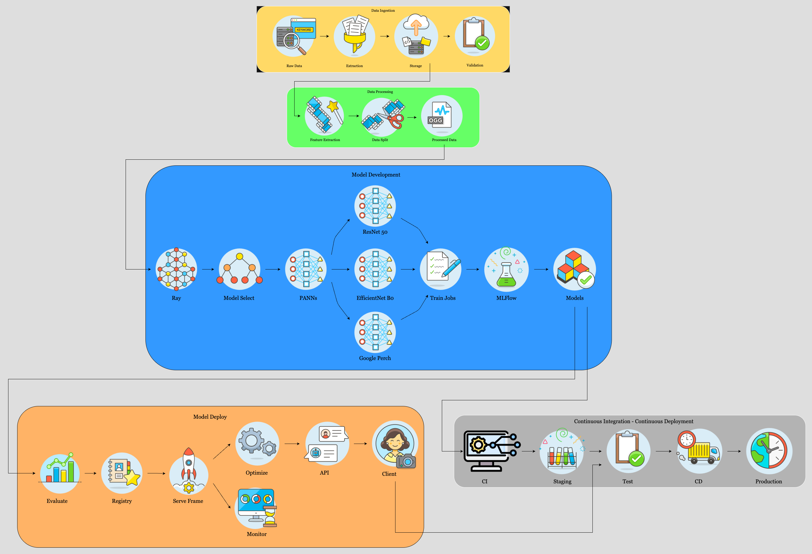

# El Silencio Acoustic Explorer: An MLOps Pipeline for Real-time Bioacoustic Monitoring

## Value proposition

This project proposes a machine learning system, "El Silencio Acoustic Explorer," designed for integration into the existing services of Ecotour Operators in the El Silencio Natural Reserve.

## 1. Value Proposition

**"El Silencio Acoustic Explorer"** is a real-time bioacoustic monitoring system designed to enhance the eco-tourism experience within _El Silencio Natural Reserve_. By providing an API endpoint for integration into a mobile application (app development outside this project's scope), our system enables tour guides to instantly identify vocalizing fauna (birds, amphibians, mammals, insects) directly from audio recordings captured during tours. This delivers the following benefits:

- **Reveals Hidden Biodiversity:** Uncovers species often missed by visual observation, significantly enriching the tour experience.
- **Increases Customer Engagement and Education:** Provides real-time information, transforming passive observation into an interactive learning experience.
- **Empowers Tour Guides:** Equips guides with a powerful tool for accurate and immediate species identification, enhancing their expertise and credibility.
- **Unique Selling Proposition:** Creates a distinctive and technologically advanced tour offering, attracting a wider range of eco-tourists.
- **Data Collection for Ecological Studies:** Provides valuable data for ecological studies conducted within the El Silencio Natural Reserve.

### Target Customers

Specifically:

Local El Silencio Natural Reserve **eco-tour operators**.
- [El Silencio Silvestre](https://elsilenciosilvestre.org/)
- [Tree Hugger Travel](https://www.treehuggertravel.com.au/eco-rewards-points-programme/supporting-wlt-in-el-silencio-nature-reserve-colombia/)
- [Manakin Nature Tours](https://www.manakinnaturetours.com/natural-reserves-and-protected-areas/)

Potential expansion:

- Colombia Birdwatch
- Andes EcoTours
- Selva Verde Lodge & Private Reserve

---

## 2. Non-ML Status Quo

Currently, fauna identification in El Silencio Natural Reserve tours relies heavily on:

- **Visual Spotting:** Limited to species that are easily visible, missing many nocturnal or elusive species.
- **Human Guide Acoustic Skills:** Subjective and variable accuracy, leading to missed identifications and uncertainty.
- **Manual Reference Books:** Inefficient and not real time.

This results in an incomplete and potentially inaccurate portrayal of the reserve's biodiversity, limiting the educational value and customer satisfaction.

---

## 3. Project Success Metrics

### **Primary Technical Metric (Proxy for Core Capability):**

- **Mean Average Precision (mAP):** Target mAP > 0.5  
  _Justification:_ Directly reflects the model's accuracy in species identification, which is the foundation of the system's value.

### **Secondary Business-Oriented Metrics:**

- **Species Diversity per Tour Session:** Increase the average number of identified species per tour by compared to pre-implementation baseline data.
- **Customer Engagement Metrics (Proxy):** Increase app usage time and interaction frequency during tours.
- **Tour Guide Proficiency Enhancement (Qualitative):** Document positive feedback from tour guides regarding the system's usability and effectiveness.
- **New Tour Offering Differentiation:** Document positive feedback regarding the system's contribution to a unique selling proposition.
- **Data Collection for Ecological Studies:** Document the amount of species data collected.

## Contributors

| Name                      | Responsible for                          | Link to their commits in this repo |
| :------------------------ | :--------------------------------------- | :--------------------------------- |
| Sudharshan Ramesh         | _Model training and training platforms_  | [Link](https://github.com/exploring-curiosity/MLOps/commit/7ec8ed17fabe7fd0cdee15cfc69fa24f580612cc)                                   |
| Vaishnavi Deshmukh        | _Data pipeline_                          | [Link](https://github.com/exploring-curiosity/MLOps/commit/8ceb0d980d012b9107320b73b1f076594d53de16)                                   |
| Mohammad Hamid            | _Continuous X CI/CD_                     | [Link](https://github.com/exploring-curiosity/MLOps/commit/b0420543b480bccfb5286a535de15502e8e6ffe9)                                   |
| Harish Balaji Boominathan | _Model serving and monitoring platforms_ | [Link](https://github.com/exploring-curiosity/MLOps/commit/ccde2eb005f322b3a037927b81b77124774a66a0)                                   |

### System diagram

### Summary of outside materials

| Resource                                                       | How it was created                                                                                                                                                                                                                                                                                                                                                                                                                                                                                                                                                               | Conditions of use                                                                                                                                                                                                                                      |
| :------------------------------------------------------------- | :------------------------------------------------------------------------------------------------------------------------------------------------------------------------------------------------------------------------------------------------------------------------------------------------------------------------------------------------------------------------------------------------------------------------------------------------------------------------------------------------------------------------------------------------------------------------------- | :----------------------------------------------------------------------------------------------------------------------------------------------------------------------------------------------------------------------------------------------------- |
| **Data set 1:** BirdCLEF 2025 (El Silencio Focus)              | Dataset provided via Kaggle for the BirdCLEF 2025 competition. Focuses on El Silencio Natural Reserve, Colombia. Includes:   - `train_audio/`: Short labeled recordings (primary/secondary labels for 206 species: birds, amphibians, mammals, insects) from Xeno-canto, iNaturalist, CSA. 32kHz OGG format. **(7.82 GB)**. Metadata in `train.csv`.   - `train_soundscapes/`: Unlabeled 1-minute soundscapes from El Silencio. 32kHz OGG format. **(4.62 GB)**.   **Total provided training/unlabeled data (`train_audio` + `train_soundscapes`) is approx. 12.5 GB.** [https://www.kaggle.com/competitions/birdclef-2025/data](https://www.kaggle.com/competitions/birdclef-2025/data) | License: **CC BY-NC-SA 4.0**. For research purposes: Requires attribution (BY), prohibits commercial use (NC), and requires adaptations be shared under the same license (SA). Suitable for non-commercial academic research.                          |
| **Base model 1:** Pre-trained SED Model: PANNs (CNN14 variant) | PANNs (Large-Scale Pretrained Audio Neural Networks) by Kong et al. (2020). Trained on AudioSet. CNN14 architecture. Paper: [https://arxiv.org/abs/1912.10211](https://arxiv.org/abs/1912.10211), Code/Weights: [https://github.com/qiuqiangkong/audioset_tagging_cnn](https://github.com/qiuqiangkong/audioset_tagging_cnn)                                                                                                                                                                                                                                                     | License: **MIT License** (as per linked repository). Permits reuse, modification, distribution, and sublicensing for both private and commercial purposes, provided the original copyright and license notice are included. Suitable for research use. |
| **Base model 2:** EfficientNet-B0                              | Developed by Google Research (Tan & Le, 2019). Pre-trained on ImageNet. Smallest variant (\~5.3M parameters). Paper: [https://arxiv.org/abs/1905.11946](https://arxiv.org/abs/1905.11946)                                                                                                                                                                                                                                                                                                                                                                                        | Apache 2.0 License. Pre-trained weights available. Will be **fine-tuned** on `train_audio` (Mel spectrograms) for the 206-species classification task.                                                                                                 |
| **Base model 3:** Google Perch (Bird Vocalization Classifier)  | Developed by Google Research. Pre-trained on bird sounds. Available on Kaggle Models under the name "Perch". [https://www.kaggle.com/models/google/bird-vocalization-classifier](https://www.kaggle.com/models/google/bird-vocalization-classifier). Model details/parameters may vary by version. **Applicability to non-bird species requires careful evaluation.**                                                                                                                                                                                                            | **Apache 2.0 License** (as per Kaggle model details). Will be **fine-tuned** (if possible) or used for **feature extraction** on `train_audio` data. Performance impact on non-bird classes (mammals, amphibians, insects) must be assessed.           |
| **Architecture 4:** ResNet-50                                  | Architecture by Microsoft Research (He et al., 2015). (\~25.6M parameters). Paper: [https://arxiv.org/abs/1512.03385](https://arxiv.org/abs/1512.03385)                                                                                                                                                                                                                                                                                                                                                                                                                          | Architecture well-established. Will be **trained from scratch** on `train_audio` (Mel spectrograms) for the 206-species classification task. No ImageNet pre-training used. Fulfills "train from scratch" requirement.                                 |
| **Tool:** Ray                                                  | Open-source framework for distributed computing. [https://www.ray.io/](https://www.ray.io/)                                                                                                                                                                                                                                                                                                                                                                                                                                                                                      | Apache 2.0 License. Used for scheduling training jobs and distributed training on Chameleon.                                                                                                                                                           |
| **Tool:** MLflow                                               | Open-source platform for MLOps. [https://mlflow.org/](https://mlflow.org/)                                                                                                                                                                                                                                                                                                                                                                                                                                                                                                       | Apache 2.0 License. Will be self-hosted on Chameleon for experiment tracking.                                                                                                                                                                          |

### Summary of infrastructure requirements

<!-- Itemize all your anticipated requirements: What (`m1.medium` VM, `gpu_mi100`),
how much/when, justification. Include compute, floating IPs, persistent storage.
The table below shows an example, it is not a recommendation. -->

| Requirement     | How many/when                                     | Justification |
| --------------- | ------------------------------------------------- | ------------- |
| `m1.medium` VMs | 4 for entire project duration    - 1 for Development/Coordination (Project duration).   - 1 for MLflow Server (Project duration).   - 1 for Ray Cluster Head Node (Active training periods).   +1 Optional later for API.                    | Essential for hosting persistent services (MLflow), managing training cluster (Ray Head), stable development environment, potential API serving. Assumes CPU-only sufficient.         |
| `compute_liquid`     | Concurrent access to up to 4 GPUs. 4-8 hour block twice a week                         | Required for intensive ResNet-50 scratch training, fine-tuning, and multi-GPU FSDP experiments (needs up to 4 GPUs concurrently). A100 GPUs provide necessary compute power. Usage is intermittent but demanding.              |
| Floating IPs    | 	2 required for project duration.   +1 Optional later. | Provides persistent external IPs for Development VM (SSH) and MLflow Server UI. Potential third IP for externally accessible API endpoint.             |
| Persistent Storage | Estimate: 100 GB needed throughout project duration. | Required for reliable storage of dataset (~12.5GB+), source code, MLflow artifacts (models, logs, checkpoints), environments. Ensures data persistence beyond ephemeral node storage and across project sessions. |

### Detailed design plan

<!-- In each section, you should describe (1) your strategy, (2) the relevant parts of the
diagram, (3) justification for your strategy, (4) relate back to lecture material,
(5) include specific numbers. -->

#### Model training and training platforms

This section details the plan to satisfy Unit 4 and Unit 5 requirements, incorporating learnings from the course units.

**Requirement 4.1: Train and Re-train At Least One Model**

1.  **Strategy:** Train **ResNet-50** classifier from scratch using `train_audio`. Fine-tune **EfficientNet-B0** and **Google Perch**. Based on techniques explored in Unit 4 for handling memory limits with larger models, anticipate applying memory-saving strategies like **reduced precision (bf16)**, **gradient accumulation**, or potentially the **SGD optimizer** for the ResNet-50 training if Adam proves too memory-intensive. Address the "re-train" requirement via a simulation: use a time-split of `train_audio` (older \~70% initial train, newer \~30% re-train) based on scraped Xeno-canto timestamps, using only provided data to mimic adaptation to temporal drift. Implement this re-training process as a pipeline on Ray, manually triggered.
2.  **Relevant Diagram Parts:** Training Pipeline, Data Storage (time-split `train_audio`), versioned Model Weights storage.
3.  **Justification:** Meets train/re-train requirements using only provided data. Time-split simulates realistic adaptation scenario. Leverages memory-saving techniques demonstrated as effective in Unit 4 if required for the ResNet-50 scratch training. Contingent on successful timestamp scraping (requires implementation/error handling).
4.  **Relation to Lecture Material:** Memory Optimization Techniques (Reduced Precision, Gradient Accumulation, Optimizers like SGD vs Adam), Ray Framework (for pipeline execution).
5.  **Specifics:** Initial Data: \~70% `train_audio` (\~5.5 GB). Re-train Data: \~30% `train_audio` (\~2.3 GB). Split via scraped timestamps. Initial ResNet-50 epochs: \~75. Re-train epochs: \~10-20. Requires scraping script with error handling. Models versioned. Evaluate need for bf16/SGD/GradAcc during initial ResNet-50 training based on observed memory usage.

**Requirement 4.2: Modeling Choices**

1.  **Strategy:** Employ a multi-model ensemble for classifying 206 species: (a) **ResNet-50** (scratch-trained), (b) **EfficientNet-B0** (fine-tuned), (c) **Google Perch** (fine-tuned). Leverage the parameter efficiency of EfficientNet-B0 (\~5M params) and potentially Perch. For fine-tuning these, utilize **Parameter-Efficient Fine-Tuning (PEFT) via LoRA**, leveraging methods explored in Unit 4 that demonstrate significant memory savings for fine-tuning, potentially combined with **Quantization (e.g., nf4)** if further memory reduction is needed. Incorporate features from a pre-trained **PANNs (CNN14)** for SED during inference. Process 32kHz OGG audio into Mel spectrograms. Handle multi-label classification. Output probabilities per 5-second interval for evaluation simulation, and handle short segments for the API.
2.  **Relevant Diagram Parts:** Inference Pipeline (SED input, Spectrograms, 3 Classifiers, Ensemble Logic), Data Storage (audio, spectrograms).
3.  **Justification:** Ensemble targets robustness. Model diversity. PEFT/LoRA provides an efficient fine-tuning path, building on Unit 4 explorations. Pre-trained SED leverages existing work. Meets "3+ models" and "composed models" criteria. Addresses data specifics and output requirements.
4.  **Relation to Lecture Material:** Parameter-Efficient Fine-Tuning (PEFT/LoRA), Quantization (nf4).
5.  **Specifics:** Classifiers: ResNet-50 (\~25.6M params, scratch), EfficientNet-B0 (\~5M params, LoRA fine-tune), Google Perch (LoRA fine-tune). SED: PANNs (CNN14). Input: 32kHz audio -> Mel spectrograms (128 bands). Output: 206 species probabilities. Ensemble: Weighted averaging. Metric: mAP > 0.5 target. Consider nf4 quantization during PEFT if memory is constrained.

**Requirement 4.3 (Difficulty Point): Use Distributed Training to Increase Velocity**

1.  **Strategy:** Use **PyTorch FSDP (Fully Sharded Data Parallel)** for the ResNet-50 scratch training, targeting increased velocity and leveraging FSDP's memory efficiency potential, as explored in Unit 4's comparison of distributed strategies (DDP vs FSDP). Execute experiments on the Ray cluster across 1, 2, and 4 GPUs (subject to availability). Measure training time for fixed epochs (\~50) with a consistent global batch size.
2.  **Relevant Diagram Parts:** Training Pipeline on Ray Cluster (utilizing multiple GPU workers).
3.  **Justification:** Addresses potential ResNet-50 memory bottlenecks and accelerates training. Directly leverages insights from Unit 4 regarding FSDP's memory reduction benefits compared to DDP, especially for larger models or constrained memory situations. Fulfills difficulty point by experimentally comparing scaling performance using an advanced distributed technique.
4.  **Relation to Lecture Material:** Distributed Training Strategies (DDP, FSDP), Scaling (Time/Memory vs #GPUs).
5.  **Specifics:** Target: ResNet-50 training. Experiment: 1 vs 2 vs 4 GPUs for 50 epochs. Strategy: PyTorch FSDP. Global Batch Size: 256 (example, tune based on memory). Metric: Wall-clock time. Output: Plot time vs. #GPUs. Requires FSDP configuration (wrapping, etc.). Compare time/memory scaling results against Unit 4 observations.

**Requirement 5.1: Experiment Tracking**

1.  **Strategy:** Deploy and manage a **self-hosted MLflow server** on Chameleon. Instrument all training scripts to log parameters, system metrics (GPU util/memory), model metrics (loss, mAP), git commit hashes, and artifacts including model checkpoints and dependencies, utilizing MLflow's comprehensive logging capabilities demonstrated in Unit 5. Leverage **MLflow's UI for visualization** (e.g., plotting GPU utilization against epoch time to identify bottlenecks) and **comparing runs**. Register final candidate models using the **MLflow Model Registry**. Consider Pytorch Lightning autologging if applicable, based on Unit 5 explorations.
2.  **Relevant Diagram Parts:** Experiment Tracking Server (MLflow) connected to Training Pipeline. Artifact storage linked.
3.  **Justification:** Meets self-hosted tracking requirement. Enables reproducibility, systematic comparison, and performance debugging (e.g., GPU bottlenecks), leveraging the extensive tracking and UI features of MLflow explored in Unit 5. Essential for organized MLOps.
4.  **Relation to Lecture Material:** MLflow (Source version logging, Parameter/Metric/Artifact Logging, System Metrics Logging, Visualizations, Model Registry, Autologging, Comparing Runs).
5.  **Specifics:** 1 self-hosted MLflow instance. Log key parameters/metrics. Utilize visualization and comparison views. Use model registry. Planned experiments: hyperparameter sweeps, model comparisons (ResNet/EffNet/Perch, LoRA vs full), SED impact, ensemble performance.

**Requirement 5.2: Scheduling Training Jobs (Ray Cluster)**

1.  **Strategy:** Use a **Ray cluster** on Chameleon for submitting all training/re-training jobs via Ray Jobs API/CLI. Specify **resource requests (CPU, GPU)** per job, informed by Unit 4 memory findings and Unit 5 explorations of resource allocation and scheduling outcomes. Monitor jobs and cluster state via the **Ray dashboard**. Utilize **Ray Train checkpointing for fault tolerance**, leveraging recovery capabilities explored in Unit 5 to avoid costly restarts upon worker failure.
2.  **Relevant Diagram Parts:** Ray Cluster (Head, Workers) on Chameleon Infrastructure, executing Training Pipeline jobs.
3.  **Justification:** Fulfills requirement to use Ray. Leverages Ray's demonstrated capabilities (Unit 5) for scheduling, resource management (including handling infeasible requests, fractional GPUs, simultaneous jobs), monitoring, and fault tolerance, suitable for managing the project's training workload.
4.  **Relation to Lecture Material:** Ray Framework (Ray Train, Ray Dashboard, Ray Jobs, Resource Management, Scheduling, Fault Tolerance).
5.  **Specifics:** 1 Ray cluster (e.g., 1 head, 4 GPU workers) on Chameleon. Use Ray Jobs to submit Python scripts. Specify resource requests (CPU/GPU counts). Utilize Ray Train checkpointing. Monitor via Ray dashboard.

#### Model serving and monitoring platforms

This section outlines the plan to satisfy Unit 6 and Unit 7 requirements.

#### Unit 6: Model Serving

#### Requirement 6.1: Serving from an API Endpoint

Our strategy involves exposing the final ensemble model (ResNet-50, EfficientNet-B0, and Google Bird Classifier with PANNs features) through a FastAPI endpoint. This API will be deployed on a cloud-based GPU server using a containerized microservice architecture. We support both PyTorch and ONNX runtime endpoints, switching to ONNX for performance-critical deployments. The API accepts base64-encoded `.ogg` audio clips (or extracted Mel spectrograms) and returns a multi-label prediction of species along with confidence scores. This aligns directly with the real-time use case for tour guides and tourists in El Silencio.

#### Requirement 6.2: Identify Requirements (Latency, Throughput, Concurrency)

Our target requirements are informed by the mobile tour guide use case:

- **Model Size**: ≤ 25MB (with quantized ONNX models).
- **Latency (Online Inference)**: < 200ms median latency on GPU-based cloud inference, including preprocessing of a 5-second `.ogg` clip.
- **Throughput (Batch Inference)**: ≥ 200 frames/sec on CPU, ≥ 1000 frames/sec on GPU.
- **Concurrency**: Support at least 8 concurrent users per node with latency < 300ms (95th percentile).

#### Requirement 6.3: Model Optimizations to Satisfy Requirements

We apply several model-level optimizations:

- **Graph Optimizations**: Using ONNX Runtime’s extended optimization level.
- **Quantization**: Applying both dynamic and static post-training quantization with Intel Neural Compressor.
- **Model Compilation**: TorchScript for PyTorch models and optimized ONNX sessions.
- **Hardware-Specific Execution Providers**: CUDA (GPU), OpenVINO (CPU), and TensorRT (optimized GPU).

Each variant is benchmarked on Chameleon cloud nodes. Performance metrics (latency, throughput, model size) are logged to MLflow.

#### Requirement 6.4: System Optimizations to Satisfy Requirements

To maintain low latency under concurrent access, we apply system-level strategies using Triton Inference Server:

- **Dynamic Batching**: Batch sizes 4–16.
- **Model Replica Management**: Multiple instances per GPU node.
- **Resource Monitoring**: `nvidia-smi` and Prometheus-Grafana dashboards.
- **Prioritized Queuing**: Queue policies to minimize worst-case response times.

#### Extra Difficulty Point: Multiple Options for Serving

To explore cost-performance tradeoffs, we evaluate three deployment configurations:

- **Server-grade CPU (AMD EPYC)** with ONNX + OpenVINO backend (target latency < 500ms per clip).
- **Server-grade GPU (A100)** with ONNX + TensorRT backend (target latency < 200ms per clip).
- **On-device deployment** with quantized MobileNetV2 (planned for post-project exploration).

We compare accuracy, latency, throughput, and projected cost across these setups to inform production scaling decisions.

---

#### Unit 7: Evaluation and Monitoring

#### Requirement 7.1: Offline Evaluation of Model

After each training run, we execute an evaluation pipeline that includes:

1. **Standard Evaluation**: On labeled El Silencio `.ogg` soundscapes.
2. **Domain-Specific Slices**: Nighttime recordings, low signal-to-noise regions, insect-dominant samples.
3. **Failure Mode Tests**: Overlapping vocalizations, weak signals, background interference.
4. **Unit Tests**: Checks for top-K accuracy, coverage, and label frequency.

If a model passes the quality bar (e.g., mAP > 0.5), it is registered in MLflow. Failures trigger retraining.

#### Requirement 7.2: Load Test in Staging

The FastAPI + Triton stack is deployed to a staging node. We simulate 8 to 32 users using Python benchmarks and Triton’s `perf_analyzer` to record:

- Median and 95th percentile latency
- Throughput in predictions/sec
- GPU and CPU usage trends

This informs autoscaling and concurrency planning.

#### Requirement 7.3: Online Evaluation in Canary

We simulate different user patterns:

- **Tour Guide Mode**: Streams 5-second `.ogg` segments.
- **Power User Mode**: Uploads 1-minute `.ogg` recordings.
- **Mobile User Mode**: Random upload delays and interruptions.

Manual inspection of predictions evaluates responsiveness, stability, and correctness. Passing the canary test allows promotion to production.

#### Requirement 7.4: Close the Loop

We implement real-world feedback mechanisms:

- **User Feedback Hook**: App integration will allow guides to flag wrong predictions.
- **Passive Feedback Logging**: 5% of queries (and their audio) are saved and periodically labeled to support retraining.

#### Requirement 7.5: Business-Specific Evaluation

Our proxy business metric is:

- **Species Diversity per Tour Session**: Number of unique species detected in a single outing.

Logged per tour, this serves as a proxy for user engagement and tour value.

<!-- ## Data pipeline

## Table of Contents

1. [Data Pipeline](#data-pipeline)
   - [Strategy & Relevant Diagram Parts](#strategy--relevant-diagram-parts)
   - [Justification & Relation to Lecture Material](#justification--relation-to-lecture-material)
   - [Specific Numbers & Implementation Details](#specific-numbers--implementation-details)
   - [Difficulty Points Attempted](#difficulty-points-attempted)
2. [Persistent Storage Justification](#persistent-storage-justification) -->

## Data Pipeline

### Strategy & Relevant Diagram Parts

Our data strategy centers on robust management of both offline (training) and online (inference) data workflows, utilizing Chameleon's persistent storage as a central repository.

- **Centralized Storage:** Chameleon's persistent storage will serve as the primary data repository, enabling efficient shared access and management of large datasets.
- **Offline Processing (Batch ETL):** An ETL pipeline will process raw dataset batches, preparing them for model training. This includes feature extraction such as Mel spectrograms.
- **Online Processing (Simulated Stream):** A simulated pipeline will handle data inference, mimicking real-world streaming conditions.
- **Feature Consistency:** Ensuring the training and inference features remain identical by centralizing transformation logic and possibly storing processed features in a Feature Store.

### Justification & Relation to Lecture Material

- **Scalability & Collaboration:** Central persistent storage is critical for managing large datasets (~14GB raw) and facilitating team-wide access.
- **Reproducibility & Structure:** The ETL pipeline ensures structured, repeatable transformations from raw audio to analysis-ready features.
- **Realism & Testing:** Simulating online data streams allows comprehensive pipeline testing before encountering the hidden test set.
- **Consistency & Reliability:** Prevents training-serving skew by standardizing feature generation and transformation workflows.

### Specific Numbers & Implementation Details

#### **Persistent Storage:**

- **Requirement:** 100 GB on Chameleon.
- **Justification:**
  - Raw data (~14GB)
  - Processed features (Mel spectrograms, ~20-30GB)
  - Model artifacts (~10GB)
  - Container images and logs (~2GB)
  - Expansion room for experimentation (~44GB for reprocessed or extended datasets)
- **Mechanism:** Using Chameleon's persistent volume service (implementation dependent on Lab 8).

#### **Offline Data & ETL Pipeline:**

- **Repository Structure:**

  - `raw/`: Contains original `train_audio/`, `train_soundscapes/`, `train.csv`, `taxonomy.csv`
  - `processed/`: Stores Mel spectrogram features, train-validation split metadata
  - `models/`: Stores trained model checkpoints
  - `logs/`: Stores processing and inference logs

- **ETL Steps:** (Implemented via Python scripts using Pandas, Librosa, Scikit-learn):

  1. Extract raw data from Kaggle source to `raw/` directory..
  2. Transform:

     - Validate data integrity
     - Load and parse train.csv, taxonomy.csv.
     - Process audio files: load .ogg files, segment into 5-second chunks, compute Mel spectrograms using consistent parameters (e.g., n_mels, hop_length).
     - Generate labels for each segment based on train.csv, handling primary/secondary labels.
     - Create stratified train/validation splits.

  3. Load:
     - Store processed features and labels into `processed/train` and `processed/validation` directories
     - Maintain logs (sources, parameters, and output locations) using MLflow

#### **Online Data Simulation & Pipeline:**

- **Simulation Script:**

  - A script will generate simulated online data to test the inference pipeline, acting as the "producer".
    1. **Source**: It will primarily use files randomly selected from the train_soundscapes/ dataset.
    2. **Characteristics**:
       - Format: Generated files will be 1-minute OGG audio files, sampled at 32kHz, matching the expected test set format.
       - Content: Files will contain ambient sounds recorded in the El Silencio Natural Reserve. As `train_soundscapes` is unlabeled, the presence/absence of target species calls is unknown, realistically mimicking field recordings. This provides authentic background noise and acoustic channel characteristics.
       - Temporal Behavior: The script will write these files sequentially (e.g., one file every few seconds or minutes, configurable) into a dedicated `online_input/` directory on the persistent storage, simulating a stream or batch arrival of new data.
       - (Optional Enhancement): To create more challenging test cases with known calls, the script could occasionally overlay short calls (randomly selected from `train_audio/`) onto the `train_soundscapes` background audio before writing the file.

- **Online Inference Pipeline:** This pipeline acts as the "consumer".
  1. Monitors the `online_input/` directory for new `.ogg` files.
  2. On new file arrival: Loads the 1-minute `.ogg`.
  3. Applies the identical segmentation and Mel spectrogram transformation logic used in the offline ETL pipeline to ensure feature consistency.
  4. Sends the generated features (spectrograms) to the deployed model serving endpoint.
  5. Receives per-segment predictions (species probabilities).
  6. Formats the results according to requirements.
  7. Outputs formatted predictions to an `online_output/` directory (e.g., as a CSV file).

### Difficulty Points Attempted

- **Interactive Data Dashboard:** We will attempt to implement an interactive dashboard using Streamlit or Dash. This dashboard will read from the persistent storage (raw/ metadata, processed/ features) to provide visualizations of data distributions (species, quality ratings), sample waveforms/spectrograms, and potentially data quality metrics, aiding team insight.

## Persistent Storage Justification

To accommodate our dataset and processing requirements, we request **100 GB of persistent storage** on Chameleon. Our justification includes:

- **Raw dataset storage (~14 GB)**: The provided dataset includes train_audio and train_soundscapes in OGG format.
- **Processed features (~30-50 GB)**: Mel spectrograms and extracted features (depending on resolution and augmentation strategies.)
- **Model artifacts (~10-15 GB)**: Checkpoints and model weights from fine-tuned and scratch-trained architectures, and hyperparameter search logs require substantial space.
- **Container images & logs (~5-10 GB)**: Experiment tracking logs (MLflow, evaluation outputs), and online simulation files.
- **Expansion buffer**: Additional space ensures flexibility for future feature extraction methods, dataset augmentation, debugging, and computational overhead.

By implementing structured data management and efficient storage strategies, this allocation ensures smooth execution of both training and inference pipelines without bottlenecks.

#### Continuous X

Since the Lab for DevOps is yet to be released, the following points are based on the lecture notes and project requirements :

1. The aim to setup a pipleine where in any changes to the model made should be available to the end user automatically.
2. In Continous X, we will create scripts that would deploy services in the cloud for deployment, like Compute Instances, Security groups etc. Any resource that has to be provisioned, will be done using scripts, like Terraform or Python.
3. The end service and the model would exist in their separate microservices which would be containerized.
4. This pipeline will :
   4.1 Could be triggered automatically or manually.
   4.2 Will re-train the model.
   4.3 Run the complete offline evaluation suite.
   4.4 Apply the post-training optimizations for serving.
   4.5 Test its integration with the overall service.
   4.6 Package it inside a container for the deployment environment
   4.7 deploy it to a staging area for further testing
5. Once the artifacts are moved into the staging area, and once everything is working fine, we should be able to promote
   to higher environments.
6. Will learn more about the CI/CD once the Lab3 is released and can update this part again.
